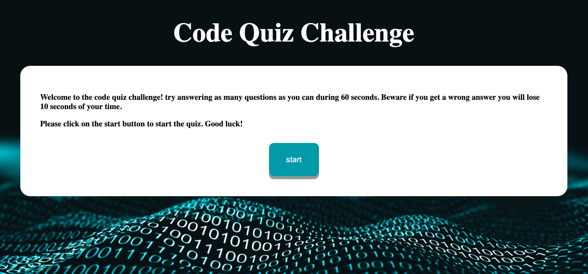
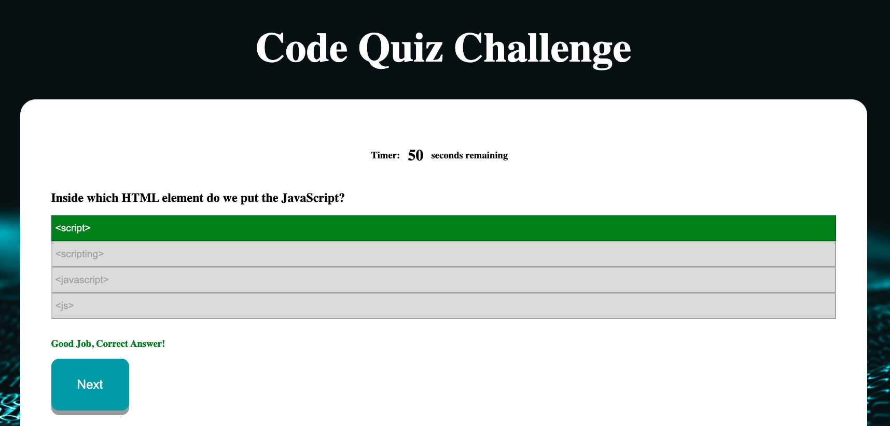

# Code-Quiz
## Overview
For this assignment we were tasked to create a timed quiz. In my quiz I created a single html page with 3 blocks which contained the start, question, and endportion of the quiz. In my quiz once a respondent hits start they are automatically taken to the first question and the timer starts. As the respondent answers questions the response button turns either green or red depending on the correct answer. If the respondent selects a wrong answer their time is reduced by 10 seconds as well. Once the respondent answers all questions or takes over 60 seconds to complete they are taken to the final page. There they are able to submit their initials and see high scores as well.


## Acceptance Criteria
```
GIVEN I am taking a code quiz
WHEN I click the start button
THEN a timer starts and I am presented with a question
WHEN I answer a question
THEN I am presented with another question
WHEN I answer a question incorrectly
THEN time is subtracted from the clock
WHEN all questions are answered or the timer reaches 0
THEN the game is over
WHEN the game is over
THEN I can save my initials and my score
```



## Learning

With this assignment I was able to grow my expertise with javascript. I was able to create events based of a viewers action on the page. I was able to save input items from viewers. I was also able to manipulate css withought having to do it manually on the css sheet.